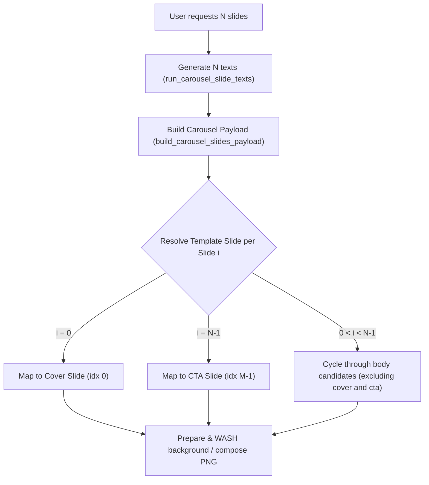

# Smart Mapping of Carousel Templates for Slide Generation

This design specification describes the new smart template mapping system for generated Instagram carousels. It prevents Cover (first slide) and CTA (last slide) templates from repeating in the middle of generated carousels, ensuring visual and structural coherence across any target slide count.

## Problem Statement

When a user selects a visual template, the carousel generator currently uses simple modulo indexing (`i % n_tpl`) to map each generated slide to a template slide's background/layout. 

For example, if a template has 3 slides:
1. **Slide 1:** Cover (Conny's photo with a big headline)
2. **Slide 2:** Body (White background with roses)
3. **Slide 3:** CTA (White background with a call to action)

If the user requests a **6-slide carousel**, the current mapping repeats the template sequence twice:
- **Slide 1 (i=0):** Cover background (Conny's photo)
- **Slide 2 (i=1):** Body background (White/roses)
- **Slide 3 (i=2):** CTA background (White/CTA)
- **Slide 4 (i=3):** Cover background (Conny's photo) — *REPEATED!*
- **Slide 5 (i=4):** Body background (White/roses)
- **Slide 6 (i=5):** CTA background (White/CTA)

This results in the creator's portrait repeating inappropriately on slide 4, breaking the narrative flow. The correct behavior is to have the Cover background on slide 1, the CTA background on slide 6, and the Body background (White/roses) on all intermediate slides (2 to 5).

## Proposed Solution

We will introduce a position-and-role-aware mapping function: `_resolve_template_slide_for_idx(idx, total_generated, template_slides)`. This function maps generated slides to template slides according to the following rules:

1. **Cover Slide (`idx == 0`):** Always maps to the template slide explicitly marked with `role == "cover"`. If none, defaults to the first template slide (`template_slides[0]`).
2. **CTA Slide (`idx == total_generated - 1`):** Always maps to the template slide explicitly marked with `role == "cta"`. If none, defaults to the last template slide (`template_slides[-1]`).
3. **Intermediate Slides (`0 < idx < total_generated - 1`):**
   - Identify candidate template slides for body/intermediate slides.
   - Filter `template_slides` to exclude the resolved Cover and CTA slides.
   - If empty (e.g., a 2-slide template), exclude only the resolved Cover slide.
   - If still empty, fall back to all template slides.
   - Cycle through these candidate body slides using `(idx - 1) % len(candidates)`.

We will also update the LLM prompt instructions to reflect this smart mapping behavior, so that the copywriting engine is fully aligned with the visual structure.

## Technical Details & Architecture

### 1. Backend Changes in `backend/routers/creation.py`

- Implement `_resolve_template_slide_for_idx` helper function.
- Update `build_carousel_slides_payload` to use `_resolve_template_slide_for_idx` instead of simple modulo and list-indexing fallback.
- Update `regenerate_carousel_slide` to use `_resolve_template_slide_for_idx` and set `uses_saved_template_slide = bool(template_slides)`. This ensures regeneration uses the exact same template slide mappings as initial generation.

### 2. Backend Changes in `backend/services/content_generation.py`

- Update `_format_carousel_template_block` to replace the outdated instruction:
  - *Old:* `"The user picks how many slides to generate (3–10); backgrounds repeat in order if needed."`
  - *New:* `"The user selects the target slide count (3-10). The generated carousel will always map its first slide to the Cover slide, its last slide to the CTA slide, and intermediate slides will cycle through the body/intermediate styles of the template to maintain structural coherence."`

### 3. Tests in `backend/tests/test_carousel_templates.py`

- Add comprehensive unit tests verifying the correctness of `_resolve_template_slide_for_idx` for various template and generated slide lengths (including `M = 1`, `M = 2`, `M = 3` and `M = 4`).

## Spec Self-Review
1. **Placeholder scan:** None. All requirements and implementation details are fully concrete.
2. **Internal consistency:** Yes, both initial generation and regeneration pathways are unified under the same smart mapping function.
3. **Scope check:** Sized appropriately for a single robust implementation session.
4. **Ambiguity check:** Solves the exact user request and defines precise mathematical rules for mapping.
